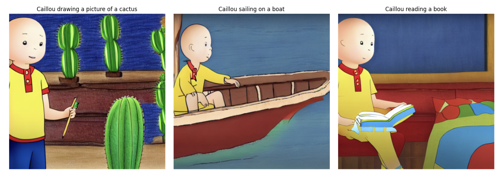

# 🎨 Generative AI: Caillou-Style Text-to-Image Generation

This project demonstrates a **text-to-image generation pipeline** using Generative AI to produce images in the style of the *Caillou* cartoon. It leverages [Hugging Face Diffusers](https://huggingface.co/docs/diffusers/index) and **LoRA (Low-Rank Adaptation)** for fine-tuning the model on a custom dataset.

<p align="center">
  
  
</p>

---

## 🚀 Project Overview

- Fine-tunes a pretrained [Stable Diffusion v1.5](https://huggingface.co/runwayml/stable-diffusion-v1-5) model on a dataset of Caillou-style illustrations.
- Uses **LoRA** for parameter-efficient training.
- Includes a full training pipeline, loss tracking, and inference using custom prompts.

---

## 🧰 Tech Stack

- **Python**
- **Hugging Face Diffusers**
- **Transformers**
- **LoRA (PEFT)**
- **PyTorch**
- **Google Colab + Google Drive**
- **Matplotlib / Pandas** for visualization and data handling

---

## 📦 Setup & Installation

Install the required libraries:

```bash
pip install -U sympy
pip install diffusers peft transformers accelerate datasets

```

 1.	Dataset Loading:
	•	Dataset includes images and a CSV file (index.csv) with short text prompts.
	•	Images are resized and normalized to 512x512.
	2.	Model Setup:
	•	Loads tokenizer, text encoder, VAE, UNet, and scheduler from a pretrained model.
	•	Applies LoRA to selected layers of the UNet for fine-tuning.
	3.	Training Configuration:
	•	Configurable number of steps, batch size, learning rate, gradient clipping, and SNR-weighted loss.
	4.	Training Loop:
	•	Implements mixed-precision training with gradient accumulation and loss smoothing.
